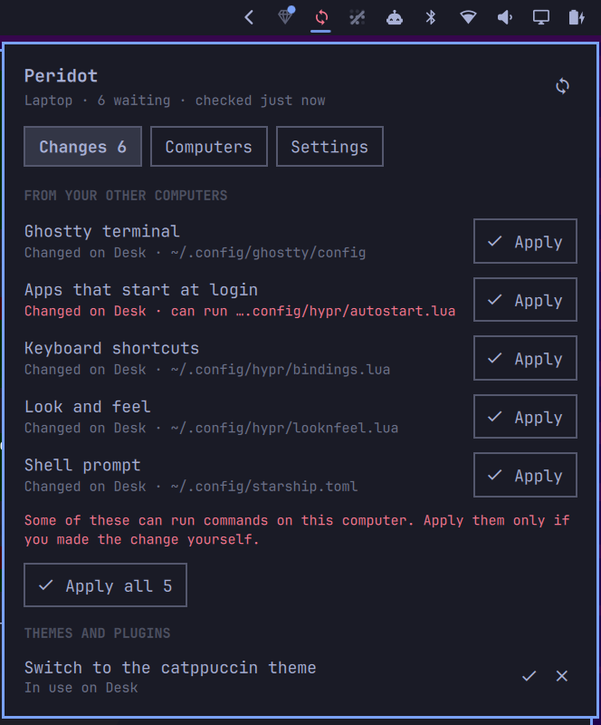

# Peridot

**Keep your Omarchy computers matching.** Your look, keyboard shortcuts, terminal, bar and menu follow you to every computer you use. There's no account to create and no cloud company holding your settings: they're encrypted on your computer before they leave it, and only your own computers can read them.



> Peridot is new. It works end to end (pairing, syncing, undo, recovery kits), but expect rough edges. Make a recovery kit, and keep backups of anything precious.

## What it does

- **Sync.** Change a setting on one computer and your others are offered it: "3 settings changed on Desk · Apply". Nothing changes on a computer until you apply it (unless you turn on automatic apply), and every apply can be undone.
- **Pair a new computer.** On the new one, choose "I already use Peridot on another computer". It shows a code. Enter the code on a computer you already use, check that both screens show the same six digits, and you're done.
- **Your theme, themes and plugins.** Switch themes on one computer and the others offer to switch too. Themes and plugins installed from git on one computer are offered for install on the others.
- **Recovery kit.** A page to print or save, plus six words to write down. If you lose every computer, they bring everything back.
- **Undo.** Put back what a computer had before an apply. It stays on that computer only; your others keep theirs.

## What syncs

On by default: Hyprland settings (keyboard shortcuts, look and feel, night light…), the Omarchy bar layout, menu additions and branding, terminal configs (Alacritty, Ghostty, Kitty, Foot), btop, starship, tmux, lazygit, mpv and `.XCompose`.

Off until you turn them on, because they can run commands: apps that start at login, `.bashrc`, Omarchy hooks, Neovim, Git settings and default apps. These are always flagged before you apply them.

**Never synced:** SSH and GPG keys, keyrings, tokens and credentials, browser and Signal profiles, calendar and sync tool configs, your monitor layout and input devices, and anything that looks like it holds a secret (private keys, API tokens, `password = …` lines), whatever the setting. Files managed by a dotfile tool (symlinks, e.g. Stow) are left alone.

## Security

- **End-to-end encrypted.** Each setting is encrypted on your computer (NIP-44, with a key only your computers share) before it's sent. The servers see opaque blobs: not file names, not contents.
- **Several independent servers** store the encrypted blobs, so none of them going away loses anything, and you can add your own.
- **Pairing can't be hijacked by someone who saw the code:** both screens show a number derived from the code and each computer's one-time key. A go-between would make them differ, and nothing is shared until you confirm they match.
- **Applying is careful.** Paths are checked against what Peridot syncs, then opened by the kernel beneath your home folder with symlinks refused (`openat2`), written atomically, and never made executable. A computer can't send a file outside the sync list, even one that's otherwise valid.
- **Your key** is kept in the login keyring. On Omarchy that keyring opens with your session, so Peridot is as safe as your login and your disk encryption. That's the same as your browser's saved passwords. Peridot never shows or asks for it; the recovery kit carries it encrypted with your six words.
- **A hardened service**: no core dumps, a seccomp filter, and a read-only system. It writes only in your home folder. Installing a theme or plugin you accepted runs Omarchy's own installer, outside the service.

What Peridot can't protect against: someone who can run code as you on one of your computers can read your settings and push changes to your others. Removing a computer hides it from your list but can't wipe what it already has.

## Requirements

- Omarchy (the Quattro shell with plugins) on Arch
- A Secret Service provider: gnome-keyring (Omarchy's default)
- Already on Omarchy: `systemd`, `curl`, `jq`
- Optional: Rust, to build it yourself (`sudo pacman -S --needed rustup && rustup default stable`). Without it, the installer downloads release binaries (x86_64 and aarch64), checked against the release's checksums.

## Install

```sh
omarchy plugin add https://github.com/derekross/peridot.git --enable
~/.config/omarchy/plugins/derekross.peridot/dist/install.sh
```

Or from a clone: `git clone https://github.com/derekross/peridot.git && cd peridot && ./dist/install.sh`.

`install.sh` puts `peridotd` and `peridot` in `~/.local/bin`, enables the `peridot.service` user service and adds the Peridot icon to the bar. Nothing syncs until you choose how to start in the panel.

## Update

```sh
omarchy plugin update derekross.peridot
~/.config/omarchy/plugins/derekross.peridot/dist/install.sh
```

## Remove

```sh
~/.config/omarchy/plugins/derekross.peridot/dist/uninstall.sh   # or ./dist/uninstall.sh in a clone
omarchy plugin remove derekross.peridot                          # if added with omarchy plugin add
```

This stops and removes the service, the binaries and the plugin. Your settings files stay as they are, and your other computers keep syncing. This computer's Peridot identity is kept so it can rejoin; `uninstall.sh --purge` deletes it too (make a recovery kit first if this is your only computer).

## Use

Everything is in the panel. From a terminal:

```sh
peridot                      # what's in sync, waiting or in conflict
peridot start                # first computer
peridot pair                 # on a new computer: shows a code
peridot pair PDT-XXXX-…      # on a computer you already use: enter that code
peridot apply [paths…]       # apply what's waiting (all, or some)
peridot keep-mine <path>     # resolve a conflict with this computer's version
peridot undo / history
peridot recovery             # make a recovery kit
peridot restore              # restore from one on a new computer
peridot pause / resume / sync / devices / leave
```

## How it works

Peridot is a small service (`peridotd`) plus an Omarchy shell plugin. Under the hood it uses [Nostr](https://nostr.com), an open protocol with many independently run servers ("relays"):

- Your computers share an identity (a Nostr key) and a separate 32-byte sync secret, created on your first computer and handed to others when you pair.
- Each synced file is an encrypted NIP-78 application-data event (kind 30078) under an opaque, keyed name. Bigger files are split into chunks. Deletions are recorded too, and the newest version per file wins.
- Each computer remembers the last version it agreed on, so it can tell "changed here", "changed elsewhere" and "changed in both" (a conflict) apart. It never publishes before it has heard from the servers, so a new computer can't push its defaults over your real settings.
- Pairing messages are ephemeral events (kind 21078) between one-time keys, found through a meeting point derived from the code.
- The recovery kit is your key encrypted with NIP-49 (scrypt) under your six words. The sync secret is stored on the servers, encrypted to your key.

Because your identity is a standard Nostr key, you can later use it in other Nostr apps. [Opal](https://github.com/derekross/opal), a Nostr suite for Omarchy, can hold it for that. Peridot is built on Opal's shared crates.

## Layout

```
crates/peridot-sync  the engine: what syncs, encryption, safe file access, pairing, recovery
crates/peridotd      the service: runner (file watcher, live sync), control socket API
crates/peridot-cli   the peridot command
shell-plugin         Omarchy shell plugin (bar icon, panel)
dist                 systemd unit, install and uninstall scripts
```

## Development

```sh
cargo test                                       # unit tests + two-computer end-to-end tests
cargo run -p peridotd --example dev_relay        # a local relay for trying things out
peridotd --memory-keyring --home /tmp/h --socket /tmp/p.sock --config /tmp/p.toml --db /tmp/p.db
```

Point a scratch config's `relays` at the dev relay to experiment without touching real servers or your real files. The plugin's service is `keepLoaded`, so changes to `PeridotService.qml` need `omarchy restart shell`.

## License

MIT. Includes the EFF Long Wordlist (CC BY 3.0 US); see [NOTICE](NOTICE).
