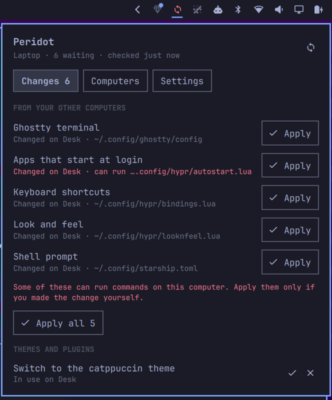

# Peridot

**Keep your Omarchy computers matching.** Your look, keyboard shortcuts, terminal, bar and menu follow you to every computer you use. There's no account to create and no cloud company holding your settings: they're encrypted on your computer before they leave it, and only your own computers can read them.



> Peridot is new. It works end to end (pairing, syncing, undo, recovery kits), but expect rough edges. Make a recovery kit, and keep backups of anything precious.

## What it does

- **Sync.** Change a setting on one computer and your others are offered it: "3 settings changed on Desk · Apply". Nothing changes on a computer until you apply it (unless you turn on automatic apply), and every apply can be undone.
- **Pair a new computer.** On the new one, choose "I already use Peridot on another computer". It shows a code. Enter the code on a computer you already use, check that both screens show the same six digits, and you're done.
- **Your theme, themes and plugins.** Switch themes on one computer and the others offer to switch too. Themes and plugins installed from git on one computer are offered for install on the others.
- **Recovery kit.** A page to print or save, plus six words to write down. If you lose every computer, they bring everything back.
- **Undo.** Put back what a computer had before an apply. It stays on that computer only; your others keep theirs.
- **Private links.** Share a file, the clipboard or your last screenshot as a link: `peridot share`, the Links tab, or Omarchy's menu → Share → Private link. The file is encrypted on your computer; the link carries the key after the `#`, which browsers never send to a server; the viewer at myperidot.app decrypts it in the browser. Links expire (7 days by default) and can be removed any time. A link can also go straight to someone as a private message (`peridot share --to name@domain`, or "Send to…" on a link): only they can read it, and the servers don't learn who wrote to whom.
- **The Gallery.** Themes and plugins from the community catalogs ([plugins.omarchy.org](https://plugins.omarchy.org) and [omarchytheme.com](https://omarchytheme.com)) with real likes and reviews from other Omarchy users, ranked by people you follow. Like, review and install in a click; publish your own setup (your theme plus the themes and plugins you installed) so someone else can install the lot in one go; put a theme or plugin nobody has listed yet on the map. Pick a name the first time, and that's all anyone ever sees of you.
- **Your identity, your way.** Start with a new key, bring one you already have, or, if [Opal](https://github.com/derekross/opal) is installed, use your Opal identity: you approve Peridot once in Opal, Peridot never sees the key, and Opal signs for it under its own rules and logs every use. Started with a new key and installed Opal later? Settings → "Move it into Opal" hands the key over (a one-time code for Opal's Add account, six words as its password); Opal holds it from then on and Peridot carries on with the same identity and sync. Settings also shows your npub and a QR code, and opens your profile in the browser.

## What syncs

On by default: Hyprland settings (keyboard shortcuts, look and feel, night light…), the Omarchy bar layout, menu additions and branding, terminal configs (Alacritty, Ghostty, Kitty, Foot), btop, starship, tmux, lazygit, mpv and `.XCompose`.

Off until you turn them on, because they can run commands: apps that start at login, `.bashrc`, Omarchy hooks, Neovim, Git settings and default apps. These are always flagged before you apply them.

**Never synced:** SSH and GPG keys, keyrings, tokens and credentials, browser and Signal profiles, calendar and sync tool configs, your monitor layout and input devices, and anything that looks like it holds a secret (private keys, API tokens, `password = …` lines), whatever the setting. Files managed by a dotfile tool (symlinks, e.g. Stow) are left alone.

## Security

**What Peridot protects against, and what it doesn't.** It protects your settings from relays and anyone reading them (two of the default relays are public), from Blossom servers, from someone who glimpsed a pairing code, from a malicious Gallery author, from a bug in Peridot borrowing Opal's signature, and, as far as a program can, from other programs running as you. It cannot protect against code already running as you: Omarchy's login keyring opens with your session, so a key Peridot keeps there is exactly as safe as your login and your disk encryption, like your browser's saved passwords. Opal mode is how you put the key out of Peridot's reach. Whoever holds the sync secret can push settings that run commands on your other computers; that is the product, so every such file is shown before it is applied, and nothing is ever applied on its own that could run code.

- **End-to-end encrypted.** Each setting is encrypted on your computer (NIP-44, with a key only your computers share) before it's sent. The servers see opaque blobs: not file names, not contents.
- **Several independent servers** store the encrypted blobs, so none of them going away loses anything, and you can add your own. Once a day Peridot checks each server for everything of yours: whatever one lacks is sent again, anything older than 30 days is published again (some servers let old events lapse), and chunk events nothing refers to any more are removed after a week's grace (NIP-09). The Settings tab shows each server's standing; `peridot tidy` checks now.
- **Pairing can't be hijacked by someone who saw the code.** The sponsor commits to a secret before the new computer shows its key and reveals it after; every message is authenticated with a key derived from the code and a Diffie-Hellman exchange; both screens show a six-digit number over the whole conversation; and the sync secret moves only after the people at **both** computers said yes. Each side fixes its randomness before seeing the other's, so a go-between gets one guess in a million and has nothing to grind. A second computer answering the same code stops the pairing visibly. Codes work once, for five minutes; a computer starts at most five pairings per quarter hour. The sync secret is encrypted to the new computer's own device key; the identity's key travels only when you tick "also keep the key on the new computer".
- **Files that can run commands are never applied unseen.** Hyprland binds, terminal and tmux configs, menu extensions, shell startup, hooks, Neovim: anything that can run a command is shown before it's applied and never auto-applied. Files are written beneath your home folder with symlinks refused (`openat2`), atomically, at 0644, never executable; a computer can't send a file outside the sync list. Anything that looks like a key, a token, a password or a credential is skipped on the way out, by path and by content.
- **Private links** use AES-256-GCM with a one-time key. The encrypted blob (name and type included) is stored on a [Blossom](https://github.com/hzrd149/blossom) server under its hash; the server sees neither. The viewer checks the hash before decrypting, and lives under a strict content security policy. Anyone with the link can open the file until it expires or you remove it, so treat links like the file itself. Peridot won't share a key, a credential or anything the secret scanner flags unless you insist from the panel.
- **The Gallery is public by design.** Likes, reviews, setups, listings, your name and who you follow are visible to anyone, under the same identity that syncs your settings (which stay encrypted). A setup lists repository addresses only, never files; its screenshot is uploaded only if you tick the box. Installing from the Gallery runs Omarchy's own installers, one step at a time, each confirmed in the panel first; only github.com, gitlab.com and codeberg.org addresses are ever handed to them, and nothing runs without the panel's own consent record (below).
- **With Opal, Peridot asks for as little as it can.** Syncing alone declares three kinds: its data, one relay login (to find your settings when you set up; from then on the sync key logs in), upload authorizations. The Gallery's kinds are declared only the first time you use it, when Opal asks you again. Opal's rules govern every signature and log it.
- **The control socket is gated.** Any program running as you can reach it, so every method is classed: reading state and routine actions for anyone; publishing as you, uploading or changing what syncs only for Peridot's own panel and command (told apart by their executable, or, from inside the daemon's sandbox where that can't be read, by the desktop session's systemd unit and the process name); exporting the key, installing software, handing your identity to another computer or stopping syncing only when confirmed in the panel, and, from the command line, only after you allow it in the panel. Rate limits throughout. This stops accidents, sandboxed apps and lazy misuse; it does not stop code that can already read the keyring or edit `~/.config` itself, and we don't claim it does.
- **A hardened service**: no core dumps, a seccomp filter, a read-only system and home apart from the folders it syncs and its own. Installing a theme or plugin you accepted runs Omarchy's own installer in its own unit, outside the service.
- **The service runs in a sandbox.** `peridot.service` sees your home folder read-only except `~/.config`, its own data and cache folders and the few top-level files it syncs; inside `~/.config`, the folders it never syncs (keys, browsers, Omarchy's own themes and plugins, systemd) are read-only again. No devices, no capabilities, no privileged or resource system calls, no netlink, private `/tmp`, and files it creates are private to you. The session bus reaches it only through `peridot-dbus-proxy.service` (xdg-dbus-proxy), which lets through the keyring and desktop notifications and nothing else; the real bus and systemd's private socket are hidden from it, so it cannot ask systemd for anything. Installing a theme or plugin runs outside it: the daemon writes one line to `peridot-install.socket`, systemd starts `peridot-install@.service` for that connection, and its fixed command re-checks the request (a repository on github.com, gitlab.com or codeberg.org, or a theme name) and runs Omarchy's own command with a clean environment. It runs nothing without your consent, and the daemon can't fake that: when you confirm an install in the panel, the panel itself writes a record of exactly what you confirmed (kind and address, hashed, timed) into `~/.local/state/peridot/consent`, a folder the daemon can't write; the install helper requires a fresh record for exactly that install and uses it up. From the command line, the panel writes it when you allow the request. So code that took the daemon over could ask, but nothing installs until a person clicks in the panel for that exact repository. `systemd-analyze --user security peridot.service` scores 1.9; the proxy 1.4.
- **The installer only touches what it can prove it wrote.** Every file `install.sh` writes is recorded with its SHA-256 in `~/.local/state/peridot/installed.tsv`, and `dist/known-hashes.tsv` lists every file each Peridot version has installed. A path is replaced or removed only while it is a regular file (never a link or a folder) whose hash matches one of those, and every replacement checks the bytes it swapped out, after the swap. Everything else stays and is named in the output; a binary or unit that isn't Peridot's stops the install before anything is written. Binaries from before Peridot kept records are replaced only with your consent and a backup Peridot never deletes. Omarchy's Share menu file is edited only with your consent, by swap-then-verify, and only lines Peridot wrote (known by their bytes) are ever taken out again. Release binaries are pinned by hash and size to the reviewed commit; the pin file can carry a minisign signature. `tests/install/` exercises all of this against a sandboxed home in CI.

- **A removed computer is cut off.** Every computer has its own device key, and the sync secret comes in numbered epochs. Removing a computer (or "Rotate now" in Settings, `peridot rotate`) mints the next epoch's secret and hands it to each remaining computer individually, encrypted between the rotating computer's device key and theirs; the removed one can see that a rotation happened and count the envelopes, but none opens for it. Everything is said again under the new keys, the old copies are deleted after a week's grace (the window in which a computer that was asleep catches up and adopts the new epoch), and a computer that missed a rotation walks forward through the announcements one epoch at a time. What a removed computer already decrypted stays there; nothing can wipe it from afar.
- **Relays can't link your settings to your identity.** Settings, deletions and relay logins are signed by a key derived from the sync secret, not by your identity; only the small root event that lets a recovery kit find the secret is signed by you. The full protocol is written up in [NIP.md](NIP.md). Timestamps are rounded to the hour and event sizes to a few fixed classes, so a relay sees that some Peridot syncs a few blobs an hour, not whose, what or how big.

Report a problem as described in [SECURITY.md](SECURITY.md).

## Requirements

- Omarchy (the Quattro shell with plugins) on Arch
- A Secret Service provider: gnome-keyring (Omarchy's default)
- Already on Omarchy: `systemd`, `curl`, `jq`
- `xdg-dbus-proxy` (`sudo pacman -S --needed xdg-dbus-proxy`): it filters the daemon's view of the session bus. The installer stops and says so if it's missing.
- Optional: Rust, to build it yourself (`sudo pacman -S --needed rustup && rustup default stable`). Without it, the installer downloads release binaries (x86_64 and aarch64) and accepts them only if they match the hashes pinned in this checkout (`dist/release-checksums.tsv`, added once each release's build attestation was verified), never a checksum file from the release itself.

## Install

```sh
omarchy plugin add https://github.com/derekross/peridot.git --enable
~/.config/omarchy/plugins/derekross.peridot/dist/install.sh
```

Or from a clone: `git clone https://github.com/derekross/peridot.git && cd peridot && ./dist/install.sh`.

`install.sh` puts `peridotd` and `peridot` in `~/.local/bin`, enables the `peridot.service` user service and adds the Peridot icon to the bar. It asks before adding Private link entries to Omarchy's Share menu (`~/.config/omarchy/extensions/omarchy-menu.jsonc`; pass `--menu` to say yes from a script; the previous file is kept as a backup). Nothing syncs until you choose how to start in the panel.

It records what it writes in `~/.local/state/peridot/installed.tsv` (path and SHA-256), checks every path before it changes anything, and prints what it keeps. If `~/.local/bin/peridotd` or `peridot` already exists without a record (a 0.1.x install), it asks before replacing it; for a non-interactive run pass `--replace-existing=<path>` for each. The old file is moved to `~/.local/state/peridot/backup/` and never deleted.

**Binaries.** With Rust installed, `install.sh` builds from source. Without it, it downloads the release matching the plugin's version from [GitHub Releases](https://github.com/derekross/peridot/releases), built by GitHub Actions from its tag. The download is accepted only if it matches the hash and size pinned in the checkout (`dist/release-checksums.tsv`, added after each release once its build attestation was verified, with the source commit the attestation names), and is bounded to that size and to sane connect, total and stall limits; when the GitHub CLI is signed in the attestation is verified again. A checkout without a pin for its version refuses the download and says so. Choose explicitly with `install.sh --build` or `install.sh --prebuilt`.

## Update

```sh
omarchy plugin update derekross.peridot
~/.config/omarchy/plugins/derekross.peridot/dist/install.sh
```

Updating keeps your identity and settings. The unit and plugin files from any earlier version are recognized by their release hashes and replaced; a file you edited stays, the output says so, and Peridot's version of it isn't installed. The service is enabled on first install only; an update restarts it if it is running Peridot's binary, and never re-enables one you disabled.

## Remove

```sh
~/.config/omarchy/plugins/derekross.peridot/dist/uninstall.sh   # or ./dist/uninstall.sh in a clone
omarchy plugin remove derekross.peridot                          # if added with omarchy plugin add
```

This stops and removes the service, the binaries and the plugin, but only what it can verify Peridot wrote: a unit or plugin file you edited stays (a changed unit is stopped, not disabled, and the script tells you what to do), a masked or linked unit is left alone, folders keep anything you added, and only Share menu lines that are still exactly Peridot's are taken out. Your settings files stay as they are, and your other computers keep syncing. This computer's Peridot identity is kept so it can rejoin; `uninstall.sh --purge` deletes it too, with its history and undo backups (`$XDG_DATA_HOME/peridot`, `$XDG_CONFIG_HOME/peridot`, `$XDG_CACHE_HOME/peridot`), after you type a confirmation, and reports whether the keyring items were actually cleared. Make a recovery kit first if this is your only computer. Backups in `~/.local/state/peridot/backup/` are never deleted, not even by `--purge`.

## Use

Everything is in the panel. From a terminal:

```sh
peridot                      # what's in sync, waiting or in conflict
peridot start                # first computer
peridot pair                 # on a new computer: shows a code
peridot pair PDT-XXXX-…      # on a computer you already use: enter that code
peridot pair PDT-XXXX-… --hold-key   # and give it the identity's key too
peridot devices / remove-device <id> / rotate   # a removed computer stops receiving
peridot apply [paths…]       # apply what's waiting (all, or some)
peridot keep-mine <path>     # resolve a conflict with this computer's version
peridot undo / history
peridot recovery             # make a recovery kit
peridot restore              # restore from one on a new computer
peridot share <file>          # private link, copied to the clipboard
peridot share --clipboard / --screenshot / --pick
peridot share <file> --to npub1… | name@domain   # and send it as a private message
peridot shares / unshare <id> / send <id> <who>
peridot gallery [words] [--themes|--plugins|--setups] [--sort top|stars|name]
peridot like <repo url> [--undo] / review <repo url> "text" --rating 5
peridot install <repo url> / install-setup <address>
peridot publish-setup "My desk" [--summary …] [--screenshot pic.png]
peridot follow <who> [--undo] / name "Derek"      # the name others see
peridot relays / relays add wss://… / relays remove …
peridot tidy                  # check the servers now, refresh, remove old pieces
peridot start --opal / --import / --fresh
peridot opal pair             # pair with Opal again (after revoking it there)
peridot opal move             # move the key this computer holds into Opal
peridot whoami                # your npub, nprofile and a profile link
peridot pause / resume / sync / devices / leave
```

## How it works

Peridot is a small service (`peridotd`) plus an Omarchy shell plugin. Under the hood it uses [Nostr](https://nostr.com), an open protocol with many independently run servers ("relays"):

- Your computers share an identity (a Nostr key) and a separate 32-byte sync secret, created on your first computer and handed to others when you pair. The secret is numbered: epoch 1 at first, one more each time a computer is removed or you rotate. From it come the names of your items, the key that encrypts them, the key that signs them (so relays never see your identity on sync traffic) and the address the next rotation is announced under. Each computer also has a device key of its own that never leaves it; a new epoch's secret is delivered to each remaining computer under that key.
- Each synced file is an encrypted NIP-78 application-data event (kind 30078) under an opaque, keyed name, dated to the hour and padded to 1, 4, 16 or 32 KiB. Bigger files are split into chunks. Deletions are recorded too, and the newest version per file wins.
- Each computer remembers the last version it agreed on, so it can tell "changed here", "changed elsewhere" and "changed in both" (a conflict) apart. It never publishes before it has heard from the servers, so a new computer can't push its defaults over your real settings.
- A daily audit asks each relay for everything under your key, compares it with what should be there (every current file entry and its chunks, the state entries, every computer's entry and the root event), re-sends gaps, re-publishes items unseen for 30 days with a newer date, and collects chunk events no current entry references. With your key on the computer, the deletion request goes out on its own; with Opal holding the key, deletions are sensitive, so they wait for "Check now" or `peridot tidy`.
- Pairing messages are ephemeral events (kind 21078) between one-time keys, found through a meeting point derived from the code.
- The recovery kit is your key encrypted with NIP-49 (scrypt) under your six words. The current sync secret is stored on the servers in a root event encrypted to your key, alongside a commitment to it, so a restored computer joins the current epoch and an older computer can tell it has been left behind ("Pair this computer again").
- The Gallery is plain, public Nostr: a like is a kind 17 website reaction on the repository URL, a review a kind 1111 comment rooted at it (NIP-22/73, with a `rating` tag), a listing a kind 1985 label in the `omarchy` namespace, a setup an addressable kind 30490 event, following is your kind 3 follow list, and your name a kind 0 profile (created only if the key has none). Likes are weighed by trust: yours and your follows' count four, their follows' two, strangers' one. Nothing needs registering first: the repository URL is the identity, so any Nostr client can react to the same things.
- Sending a link is a NIP-17 private message: a kind 14 rumor sealed and gift-wrapped (kinds 13 and 1059) to the recipient's inbox relays (kind 10050, else their read relays), with a copy wrapped to yourself.

Because your identity is a standard Nostr key, you can later use it in other Nostr apps. [Opal](https://github.com/derekross/opal), a Nostr suite for Omarchy, can hold it for that. Peridot is built on Opal's shared crates.

**With Opal.** Peridot pairs with Opal like any app: Opal asks you once, showing which program is asking (`~/.local/bin/peridotd`) and what it wants to sign, and from then on lists Peridot under Apps with everything it signed. Syncing your settings (kind 30078) and Gallery likes, reviews, listings and setups can be allowed for good; tick them when pairing so they don't ask each time. The relay login at setup, private-link uploads, your profile and follow list, taking something back, and sealing a private message are sensitive in Opal's book, so it asks about them unless you allow them for an hour or give Peridot full trust. Private messages need an Opal that knows the `dm` capability (after commit 74c048a); with an older one, sending says so. A pairing made by an older Peridot doesn't cover the Gallery; the first Gallery action then asks you to pair again. If Opal says no, Peridot waits an hour before asking again (sync now to ask sooner). Revoke Peridot in Opal at any time; Peridot then asks to pair again, from its panel or `peridot opal pair`. **Moving a key into Opal** (Settings, or `peridot opal move`) works with Opal as it is: Peridot seals the key exactly like a recovery kit (NIP-49, six words), you import that code under Profiles → Add account in Opal, and once Opal lists the account Peridot pairs for it, replaces the key in its keyring with "held by Opal", and restarts with the same identity and sync secret. Your other computers are untouched and keep their copy of the key; Opal's backup becomes your recovery kit. Opal only accepts the pairing from where it was made (the `peridot.service` unit, and the executable when Opal can read it), so a development build run from a terminal pairs again too.

## Layout

```
crates/peridot-sync  the engine: what syncs, encryption, safe file access, pairing, recovery
crates/peridotd      the service: runner (file watcher, live sync), control socket API
crates/peridot-cli   the peridot command
site                 myperidot.app: the share viewer (site/s) and landing page
shell-plugin         Omarchy shell plugin (bar icon, panel)
dist                 systemd unit, install and uninstall scripts
```

## Development

```sh
cargo test                                       # unit tests + two-computer end-to-end tests
tests/install/run.sh                             # install/uninstall against a sandboxed home
cargo run -p peridotd --example dev_relay        # a local relay for trying things out
peridotd --memory-keyring --home /tmp/h --socket /tmp/p.sock --config /tmp/p.toml --db /tmp/p.db
```

Point a scratch config's `relays` at the dev relay to experiment without touching real servers or your real files. The plugin's service is `keepLoaded`, so changes to `PeridotService.qml` need `omarchy restart shell`.

## License

MIT. Includes the EFF Long Wordlist (CC BY 3.0 US); see [NOTICE](NOTICE).
